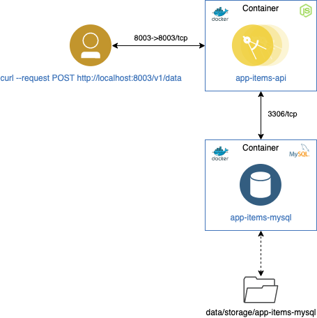

# Example NodeJS API invoking a MySQL database

Application based on [NodeJS][] using Express server.

Content:

- [Overview](#overview)
- [Requirements](#requirements)
- [Create container and API example](#create-container-and-api-example)

## Overview

This container has an Express-based server, with a service exposed `/v1/data` to query the Hardware table of the `items` database.

<p align="center">
  
</p>

[Docker]: https://docs.docker.com/get-docker
[NodeJS]: https://dev.mysql.com/downloads/

## Requirements

- [Docker][] installed.
- [MySQL container database "app-items-mysql" example installed and running.](https://github.ibm.com/CloudExpertLab/Containers/tree/master/app-items-mysql)
- [NodeJS][] installed.

## Create container and API example

1. Building the image

Go to the project directory that has the `Dockerfile` and run the following command to build the Docker image. The `-t` flag lets you tag your image so it's easier to find later using the docker images command:

`$ docker build -t app-items-api .`

Your image will now be listed by Docker:
```
$ docker images
REPOSITORY          TAG                 IMAGE ID            CREATED             SIZE
app-items-api       latest              004e40da270a        53 seconds ago      925MB
```

2. Inspect the IP address from app-items-mysql container

```
$ docker inspect -f "{{ .NetworkSettings.IPAddress }}" app-items-mysql
172.17.0.2
```

3. Create a NodeJS container instance with port forwarding to `13306`. The -p flag redirects a public port to a private port inside the container. Sets the environment variables with the `app-items-mysql` IP container. In this example 172.17.0.2

`$ docker run --name app-items-api -p 8003:8003 -e DATABASE_URL=172.17.0.2 -e DATABASE_PORT=3306 -e DATABASE_USER=user1 -e DATABASE_PASSWORD=user1 -d app-items-api`

4. From a terminal execute an API call to obtain the data from the database:

```
curl --request POST http://localhost:8003/v1/data
{"message":[{"type":"Disk","size":"P1010"},{"type":"Keyboard","size":"P2020"},{"type":"Screen","size":"P2030"},{"type":"Mouse","size":"P2040"}]}
```
