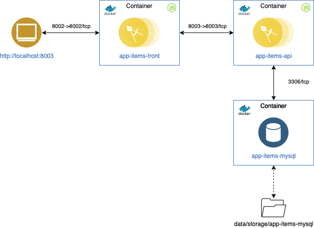
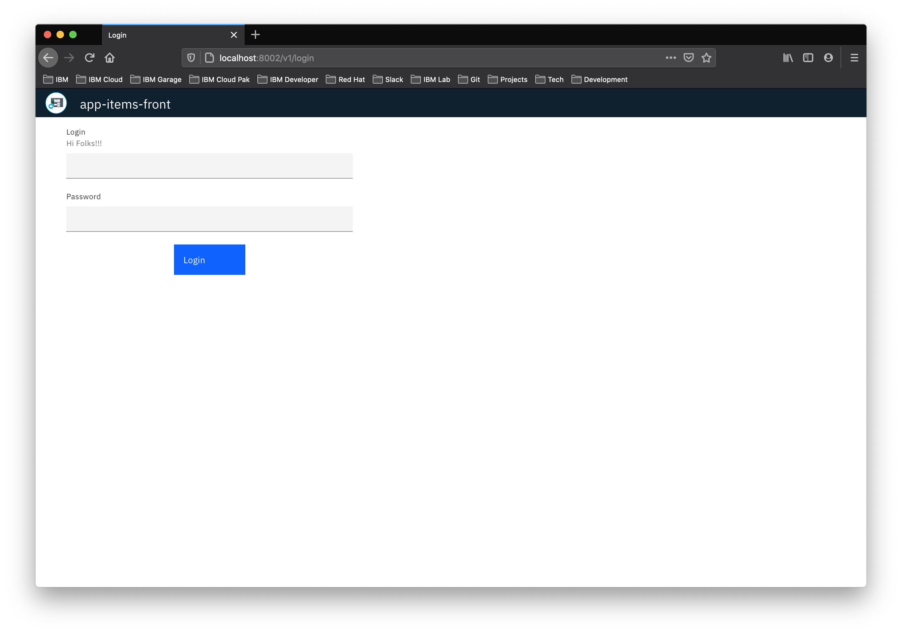
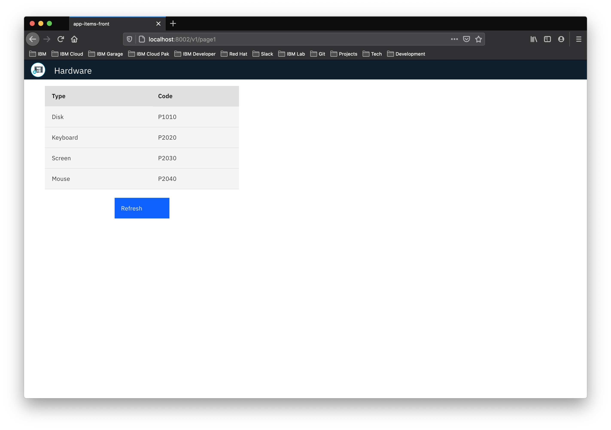

# Example Front NodeJS application

Application pattern based on [NodeJS][] using Express server. The UI is based on [Carbon][]. Carbon is IBM’s open-source design system for digital products and experiences.

Content:

- [Overview](#overview)
- [Requirements](#requirements)
- [Create container example](#create-container-example)

## Overview

Microservice that implements the front end of an application that accesses a database to perform a simple query.

<p align="center">
  
</p>

[Docker]: https://docs.docker.com/get-docker
[NodeJS]: https://dev.mysql.com/downloads/

## Requirements
- [Docker][] installed.
- [API container "app-items-api" example installed and running.](https://github.ibm.com/CloudExpertLab/Containers/tree/master/app-items-api)
- [MySQL container database "app-items-mysql" example installed and running.](https://github.ibm.com/CloudExpertLab/Containers/tree/master/app-items-mysql)
- [NodeJS][] installed.

## Create container example

1. Building the image

Go to the project directory that has the `Dockerfile` and run the following command to build the Docker image. The `-t` flag lets you tag your image so it's easier to find later using the docker images command:

`$ docker build -t app-items-front .`

Your image will now be listed by Docker:
```
$ docker images
REPOSITORY          TAG                 IMAGE ID            CREATED             SIZE
app-items-front     latest              f0fe35b6a9d0        18 minutes ago      925MB
```

2. Inspect the IP address from app-items-api container

```
$ docker inspect -f "{{ .NetworkSettings.IPAddress }}" app-items-api
172.17.0.3
```

3. Create a NodeJS container instance with port forwarding to `8002`. The -p flag redirects a public port to a private port inside the container. Sets the environment variables with the `app-items-api` IP container. In this example 172.17.0.3

`$ docker run --name app-items-front -p 8002:8002 -e API_URL=172.17.0.3 -e API_PORT=8003 -d app-items-front`

4. Open a browser with `http://localhost:8002`

<p align="center">
  
</p>

5. Enter user `admin` and password `admin` and click `Login`

<p align="center">
  
</p>

###### Developed by [@_jorgeiglesias](http://jorgeiglesiasf.blogspot.com.es/).