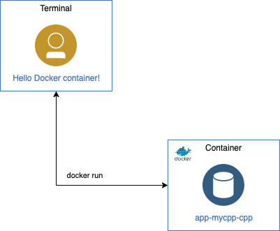

# Example C++ development with Docker containers

In this example, you will start a c++ example that runs inside a container.

Content:

- [Overview](#overview)
- [Requirements](#requirements)
- [Create container](#create-container)
- [Run example](#run-example)

## Overview

<p align="center">
  
</p>

[Docker]: https://docs.docker.com/get-docker
[GitHub]: https://github.com

## Requirements

- Install [Docker][] on your machine.
- Install [GitHub][] client on your machine.

## Create container

1. Clone the git repository `cpp-apps` using the `app-myapp-cpp` branch.

`$ git clone -b app-myapp-cpp https://github.com/jorgeiglesiasfernandez/cpp-apps.git`

2. Go to clone directory and download the Dockerfile:

```
$ cd cpp-apps/app-myapp-cpp
$ curl https://raw.githubusercontent.com/jorgeiglesiasfernandez/containers/master/app-myapp-cpp/Dockerfile > Dockerfile`
```

3. Build the image:

`$ docker build -t app-myapp-cpp .`

## Run example

1. Run the container

```
$ docker run --rm -it app-myapp-cpp
Hello Docker container!
```

###### Developed by [@_jorgeiglesias](http://jorgeiglesiasf.blogspot.com.es/).